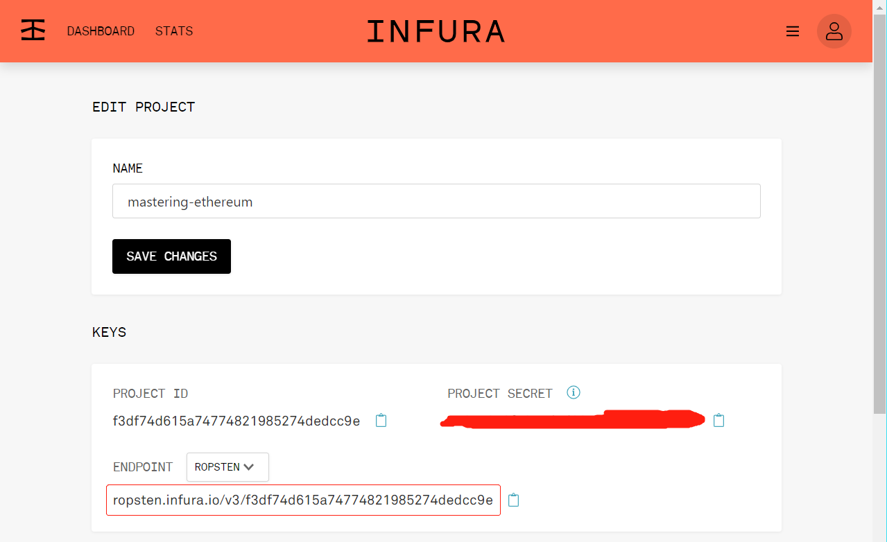

# Chapter 06. Transactions

- Transactions are signed messages
  - originated by an externally owned account
  - transmitted by the Ethereum network, and
  - recorded on the Ethereum blockchain
- Ethereum is a global singleton state machine, and transactions are what make that state machine "tick," changing its state

## The Structure of a Transaction

- The network-serialization is the only standard form of a transaction as

  |     Field | Description                                                                      |
  | --------: | :------------------------------------------------------------------------------- |
  |     Nonce | A sequence number, issued by the originating EOA, used to prevent message replay |
  | Gas price | The price of gas (in wei) the originator is willing to pay                       |
  | Gas limit | The maximum amount of gas the originator is willing to buy for this transaction  |
  | Recipient | The destination Ethereum address                                                 |
  |     Value | The amount of ether to send to the destination                                   |
  |      Data | The variable-length binary data payload                                          |
  |   `v,r,s` | The three components of an ECDSA digital signature of the originating EOA        |

- The transaction message's structure is serialized using the **Recursive Length Prefix** (RLP) encoding scheme
- All numbers in Ethereum are encoded as big-endian integers, of lengths that are multiples of 8 bits
- RLP does not contain any field delimiters or labels
- Since the address can be recovered from `v,r,s`, no address of the payer is included

## The Transaction Nonce

- **WHAT**: A scalar value equal to the number of transactions sent from this address or, in the case of accounts with associated code, the number of contract-creations made by this account
- ??The nonce is an attribute of the originating address; that is, it only has meaning in the context of the sending address
- Nonce is calculated dynamically, by counting the number of **confirmed** transactions that have originated from an address.
- 2 scenarios
  - The usability feature of transactions being included in the order of creation
    - Tx with larger nonces will be processed after those with smaller nonces
  - The vital feature of transaction duplication protection
    - By having the incrementing nonce as part of the transaction, it is simply impossible for anyone to "duplicate" a payment you have made

### Keeping Track of Nonces

- The nonce is an up-to-date zero-based count of the number of **confirmed** (i.e., on-chain) transactions that have originated from an account
- When you create a new transaction, you assign the next nonce in the sequence. But until it is confirmed, it will not count toward the `getTransactionCount` total

- DEMO of `getTransactionCount`

  1.  Sign up in [INFURA](https://infura.io/) to get a developer account
  2.  Login and create a project named "mastering-ethereum", copy and provided `ENDPOINT`
      
  3.  Create an account as [new_account.go](examples/keep-track-of-nonces/new_account.go), which produces an address as `0x9CbE8d7e7690674CD29E83Bc21fd457397cb85ee` in our case
  4.  With the address, request some ethers from one of the following faucets

      - [Ropsten Ethereum Faucet](https://faucet.ropsten.be/)
      - [Throttled Testnet Faucet](https://ipfs.io/ipfs/QmVAwVKys271P5EQyEfVSxm7BJDKWt42A2gHvNmxLjZMps/)
      - [B9lab](http://ipfs.b9lab.com:8080/ipfs/QmVAwVKys271P5EQyEfVSxm7BJDKWt42A2gHvNmxLjZMps/)
        ```bash
        curl -X POST -H "Content-Type: application/json" -d '{"toWhom":"0x9CbE8d7e7690674CD29E83Bc21fd457397cb85ee"}' https://ropsten.faucet.b9lab.com/tap
        ```

  5.  Check the balance in [Etherscan](https://ropsten.etherscan.io/address/0x9CbE8d7e7690674CD29E83Bc21fd457397cb85ee)
  6.  Play with `sendRawTransaction` as [transfer.go](examples/keep-track-of-nonces/transfer.go)

- Only when the pending and confirmed counts are equal (all outstanding transactions are confirmed) can you trust the output of `getTransactionCount` to start your nonce counter
- Parity's JSON RPC interface offers the `parity_nextNonce` function, which returns the next nonce that should be used in a transaction

### Gaps in Nonces, Duplicate Nonces, and Confirmation

- The Ethereum network processes transactions sequentially, based on the nonce
  - The txs of larger nonces will always remain pending until those of smaller nonces have been confirmed
- Invalid tx or out-of-gas tx will induce gaps in nonces, making all the subsequent transactions "stuck" in waiting for the missing nonce
- Once the gaps of nonces is validated by the network, all the broadcast transactions with subsequent nonces will incrementally become valid; it is not possible to "recall" a transaction

### Concurrency, Transaction Origination, and Nonces

- Concurrency is when you have simultaneous computation by multiple independent systems in form of
  - Multithreading in the same program
  - Multiprocessing on the same CPU
  - Distributed systems on different computers
- How do multiple computers generating, signing, and broadcasting transactions from the same hot wallet account coordinate?
  - A single computer assigns nonces on a first-come first-served basis, to computers signing transactions. However, this computer is now a single point of failure
  - Forward generated transactions (leaving out nonces) to a single node which
    - Keeps track of nonces
    - Assign the nonce and sign the txs
    - is likely to become congested under load
- The difficulties of synchronizing nonces forces most implementations toward avoiding concurrency and creating bottlenecks such as
  - a single process handling all withdrawal transactions in an exchange
  - setting up multiple hot wallets that can work completely independently for withdrawals and only need to be intermittently rebalanced

## Transaction Gas

- **Gas is not ether** -- it's a separate virtual currency with its own exchange rate against ether
- **WHY**: The open-ended (Turing-complete) computation model requires some form of metering in order to avoid denial-of-service attacks or inadvertently resource-devouring transactions
- The `gasPrice` field in a transaction allows the transaction originator to set the price they are willing to pay in exchange for gas
  > [ETH Gas Station](https://ethgasstation.info/) provides information on the cur‐ rent prices of gas and other relevant gas metrics for the Ethereum main network
- The higher the `gasPrice`, the faster the transaction is likely to be confirmed
- `gasPrice=0` means a fee-free transaction

- A query of gas price goes as [eth_gasPrice.go](examples/eth_gasPrice.go)

- If your transaction's destination address is a contract, then the amount of gas needed can be estimated but cannot be determined with accuracy. That's because a contract can evaluate different conditions that lead to different execution paths, with different total gas costs

## Transaction Recipient

- The recipient is specified in the `to` field as an EOA address or a contract address
- Ethereum does no further validation of the `to` field. Any 20-byte value is deemed valid
- Address validation is assumed to happen at the user interface level based on EIP-55
- A number of valid reasons for burning ether .
  - An example is as a disincentive to cheating in payment channels and other smart contracts —- and since the amount of ether is finite, burning ether effectively distributes the value burned to all ether holders (in proportion to the amount of ether they hold).

## Transaction Value and Data

- Both value and data are optional for tx
- 3 types of tx
  - **Payment**: A transaction with only value
  - **Invocation**: A transaction with only data
  - Both a **payment** and an **invocation**: A transaction with both value and data
- 4 examples go as
  1. Run the [new_account.go](examples/tx-value-and-data/new_account.go) script to make a new account
  2. Request 0.5 ether from [B9lab](http://ipfs.b9lab.com:8080/ipfs/QmVAwVKys271P5EQyEfVSxm7BJDKWt42A2gHvNmxLjZMps/)
     ```bash
     curl -X POST -H "Content-Type: application/json" -d '{"toWhom":"{the-newly-created-address-above}"}' https://ropsten.faucet.b9lab.com/tap
     ```
     where `{the-newly-created-address-above}` should be replaced accordingly

### Transmitting Value to EOAs and Contracts

- When you construct an Ethereum transaction that contains a value, it is the equivalent of a payment
- For recipient as an EOA address or any non-contract address
  - Ethereum will record a state change, adding the value you sent to the balance of the address
  - If the address has not been seen before, it will be added to the client's internal representation of the state and its balance initialized to the value of your payment
- For recipient as a contract address
  - The EVM will execute the contract and will attempt to call the function named in the data payload of your transaction
  - If there is no data in your transaction, the EVM will call a **fallback function** and, if that function is payable, will execute it to determine what to do next
  - If there is no fallback function, then the effect of the transaction will be to increase the balance of the contract, exactly like a payment to a wallet

### Transmitting a Data Payload to an EOA or Contract

- When your transaction contains data, it is most **likely** addressed to a contract address
- Sending a data payload to an EOA is completely valid in the Ethereum protocol. However, the interpretation of the data is up to the wallet you use to access the EOA
  - Any interpretation of the data payload by an EOA is not subject to Ethereum's consensus rules
- Assume your transaction is delivering data to a contract address
  - The data will be interpreted by the EVM as a _contract invocation_
  - Most contracts use this data more specifically as a **function invocation**, calling the named function and passing any encoded arguments to the function
- The data payload sent to an ABI-compatible contract
  - **A function selector**: The first 4 bytes of the Keccak-256 hash of the function's prototype. This allows the contract to unambiguously identify which function you wish to invoke
  - **The function arguments**: The function's arguments, encoded according to the rules for the various elementary types defined in the ABI specification
- The **prototype** of a function is defined as

  - The string containing the **name of the function**, followed by
  - The data types of each of its arguments, enclosed in parentheses and separated by commas
  - Example

    ```
    // function
    function withdraw(uint withdraw_amount) public {

    // prototype
    withdraw(uint)
    ```

- TODO: code example for data payload

## Special Transaction: Contract Creation

- Contract creation transactions are sent to a special destination address called the **zero address**; the `to` field in a contract registration transaction contains the address `0x0`
- 2 applications of zero addresses
  - Accidental payment resulting in the loss of ether
  - An intentional **ether burn** (deliberately destroying ether by sending it to an address from which it can never be spent)
    - Intentional **ether burn** is recommended sent to address `0x000000000000000000000000000000000000dEaD`
- A contract creation transaction need only contain a data payload that contains the **compiled bytecode** which will create the contract
  - Optional ether amount in the `value` field will set the new contract up with a starting balance
- It is good practice to always specify a to parameter, even in the case of zero-address contract creation, because the cost of accidentally sending your ether to `0x0` and losing it forever is too great
- TODO: a manual contract creation tx
  - construction
  - decomposing
  - funding

## Digital Signatures

### The Elliptic Curve Digital Signature Algorithm

- **WHY Digital Signature**: as proof of

  - The ownership of the private key
  - Non-repudiation: the proof of authorization is undeniable
  - Data integrity: the signed transaction data has not been and cannot be modified by anyone

  > [Wikipedia's De nition of a Digital Signature](https://en.wikipedia.org/wiki/Digital_signature)

### How Digital Signatures Work

- 2 parts
  - Signing using a private key (the signing key), from a message (which in our case is the transaction)
  - Verification only using the message and a public key

#### Creating a digital signature

- The "message" being signed is the Keccak-256 hash of the RLP-encoded data from the transaction
- The math goes as
  ```
  Sig = Sign(Keccak256(m), k)
  ```
  where
  - `k` is the signing private key
  - `m` is the RLP-encoded transaction
  - `Keccak256` is the Keccak-256 hash function
  - `Sign` is the signing algorithm
  - `Sig=(r,s)` is the resulting signature

### Verifying the Signature

- Input
  - The message (i.e., a hash of the transaction for our usage)
  - The signer's public key
  - The signature (`r` and `s` values)
- Output
  - `true` if the signature is valid for this message and public key
  - `false` otherwise

### ECDSA Math

#### `Sign`

1. Generate randomly an **ephemeral** `q`
2. Estimate the corresponding public key of `q` as `Q=q*G`
3. Let `r` be the `x` coordinate of `Q`
4. Calculate `s` as

   ```
   s ≡  q^{-1}*(Keccak256(m) + r * k) (mod p)
   ```

   where

   - `k` is the signing (EOA owner's) private key
   - `m` is the transaction data
   - `p` is the prime order of the elliptic curve

5. Output `Sig` as `(r, s)`

#### Verification

Given

- `r` and `s` are the signature values.
- `K` is the signer's (EOA owner's) public key
- `m` is the transaction data that was signed
- `G` is the elliptic curve generator point
- `p` is the prime order of the elliptic curve

Do

1. Check all inputs are correctly formed
2. Calculate `w = s^{-1} mod p`
3. Calculate `u1 = Keccak256(m) * w mod p`
4. Calculate `u2 = r * w mod p`
5. Finally, calculate the point on the elliptic curve `Q ≡ u1 * G + u2 * K (mod p)`
6. Return `true` if the x coordinate of `Q` is `r`, and `false` otherwise

### Transaction Signing in Practice

- To sign a transaction in Ethereum, the originator must:
  1. Create a transaction data structure, containing nine fields
     - `nonce`
     - `gasPrice`
     - `gasLimit`
     - `to`
     - `value`
     - `data`
     - `chainID`
     - `0`
     - `0`
  2. Produce an RLP-encoded serialized message of the transaction data structure.
  3. Compute the Keccak-256 hash of this serialized message.
  4. Compute the ECDSA signature, signing the hash with the originating EOA's private key.
  5. Append the ECDSA signature's computed `v`, `r`, and `s` values to the transaction.
     > `v` indicates two things: the chain ID and the recovery identifier to help the `ECDSArecover` function check the signature. It is calculated as either one of 27 or 28, or as the chain ID doubled plus 35 or 36

> At block #2,675,000 Ethereum implemented the "Spurious Dragon" hard fork (detailed in EIP-155) to address the tx replay attack

### Raw Transaction Creation and Signing

- TODO: demo code

### Raw Transaction Creation with EIP-155

- The EIP-155 "Simple Replay Attack Protection" standard specifies a replay-attack-protected transaction encoding
  - Includes a **chain identifier** inside the transaction data, prior to signing
  - This ensures that transactions created for one blockchain (e.g., the Ethereum main network) are invalid on another blockchain (e.g., Ethereum Classic or the Ropsten test network)
- EIP-155 adds three fields to the main six fields of the transaction data structure, namely the chain identifier, `0`, and `0`
- Chain identifiers

  |                      Chain | ID   |
  | -------------------------: | :--- |
  |           Ethereum mainnet | 1    |
  | Morden (obsolete), Expanse | 2    |
  |                    Ropsten | 3    |
  |                    Rinkeby | 4    |
  |          Rootstock mainnet | 30   |
  |          Rootstock testnet | 31   |
  |                      Kovan | 42   |
  |   Ethereum Classic mainnet | 61   |
  |   Ethereum Classic testnet | 62   |
  |      Geth private testnets | 1337 |

## The Signature Prefix Value (`v`) and Public Key Recovery

- The transaction message doesn't include a "from" field. That's because the originator's public key can be computed directly from the ECDSA signature by means of **public key recovery**
- Public key recovery goes as (given `r` and `s`)

  1. Compute two elliptic curve points, `R` and `R'`, from the `x` coordinate `r` value that is in the signature
  2. Calculate `r^{-1}`
  3. Calculate `z=Keccak256(m) (mod p)`
  4. Estimate the 2 candidate public keys as

     ```
     K1 = r^{-1} * (s*R - z*G)
     K2 = r^{-1} * (s*R' - z*G)
     ```

     > Proof  
     > `s = q^{-1}*(Keccak256(m) + r*k) (mod p)` =>  
     > `s*R = q^{-1}*R*(Keccak256(m) + r*k) (mod p)` =>  
     > `s*R = q^{-1}*q*(Keccak256(m) + r*k)*G (mod p)` =>  
     > `s*R = (Keccak256(m) + r*k)*G (mod p)` =>  
     > `s*R = (Keccak256(m)*G (mod p)) + (r*k*G (mod p))` =>  
     > `s*R = (z*G + r*K) (mod p)` =>  
     > `K = r^{-1} * (s*R - z*G)`

- The prefix value `v` tells us which of the two possible `R` values is the ephemeral public key
  - If `v` is even, then `R` is the correct value
  - If `v` is odd, then it is `R'`

## Separating Signing and Transmission (Offline Signing)

- The three steps of creating, signing, and broadcasting a transaction normally happen as a single operation, for example using `web3.eth.sendTransaction`
- **WHY** offline Signing: **security**
  - The computer signing a transaction must have unlocked private keys loaded in memory
  - The computer transmitting the tx must be online
  - If these two functions are on one computer, then you have private keys on an online system, which is quite dangerous
- **HOW**

  1. Create an unsigned transaction on the online computer where the current state of the account, notably the current nonce and funds available, can be retrieved.
  2. Transfer the unsigned transaction to an "air-gapped" offline device for transaction signing, e.g., via a QR code or USB flash drive
  3. Transmit the signed transaction (back) to an online device for broadcast on the Ethereum blockchain, e.g., via QR code or USB flash drive

  

- Manual transfering tx by means of data storage media or a webcam and QR code doesn't scale
- While not many environments can utilize a fully air-gapped system, even a small degree of isolation has significant security benefits. An application of ZeroMQ serves for this

## Transaction Propagation

- **HOW**: "flood routing" protocol
  - Each Ethereum client acts as a node in a peer-to-peer (P2P) network, which (ideally) forms a mesh network
- On average, each Ethereum node maintains connections to at least 13 other nodes, called its **neighbors**
- Each neighbor node validates the transaction as soon as they receive it. If they agree that it is valid, they store a copy and propagate it to all their neighbors (except the one it came from)
- As a result, the transaction ripples outwards from the originating node, flooding across the network, until all nodes in the network have a copy of the transaction

## Recording on the Blockchain

- **WHO**: miners feeding transactions and blocks to mining farms, which are computers with high-performance graphics processing units (GPUs)
- **HOW**: The mining computers add transactions to a candidate block and attempt to find a proof of work that makes the candidate block valid
- Valid transactions will eventually be included in a block of transactions and, thus, recorded in the Ethereum blockchain

## Multiple-Signature (Multisig) Transactions

- Ethereum's basic EOA value transactions have no provisions for multiple signatures
- Arbitrary signing restrictions can be enforced by smart contracts with any conditions you can think of, to handle the transfer of ether and tokens alike
- The ability to implement multisignature transactions as a smart contract demonstrates the flexiblity of Ethereum, at the expense of potential bugs that undermine the security of multisignature schemes
- There are, in fact, a number of proposals to create a multisignature command in the EVM that removes the need for smart contracts, at least for the simple M-of-N multisignature schemes

## Conclusions
